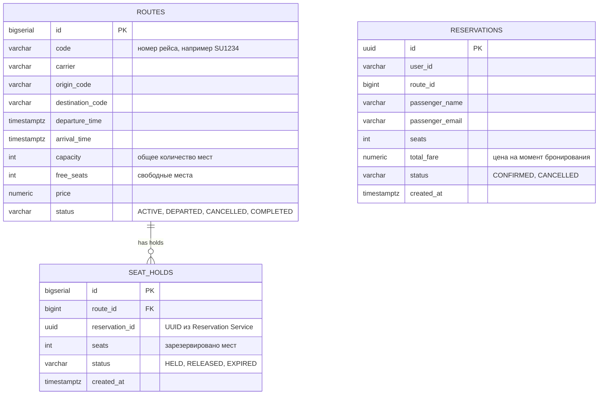

# HW3 — Flight Booking: gRPC + Redis

## Что было сделано

В этом домашнем задании я реализовал микросервисную систему бронирования авиабилетов из двух сервисов:

Reservation Service — REST API для клиентов (ранее Booking Service)

Airline Service — gRPC сервис для работы с рейсами и местами (ранее Flight Service)

Архитектурно решение построено так:

```text
Client (REST) - Reservation Service - (gRPC) - Airline Service
                      |                              |
                 PostgreSQL                     PostgreSQL + Redis
```

## ER-диаграмма



ER-диаграмма в отдельном файле:

```text
hw3-flight-booking/er-diagram.mmd
```

## Структура проекта

```text
hw3-flight-booking/
├── reservation-service/          
│   ├── db.py
│   ├── airline.proto             
│   ├── grpc_client.py
│   ├── circuit_breaker.py        
│   ├── main.py
│   ├── Dockerfile
│   ├── requirements.txt
│   └── migrations/V1__init.sql
├── airline-service/               
│   ├── db.py
│   ├── airline.proto
│   ├── main.py
│   ├── Dockerfile
│   ├── requirements.txt
│   └── migrations/V1__init.sql
├── proto/
│   └── airline.proto              
├── tests/
│   ├── conftest.py
│   └── test_retry.py
├── docker-compose.yml
├── er-diagram.mmd
└── README.md
```

## Что именно я реализовал по пунктам задания

## 1. Спроектировал доменную модель и ER-диаграмму

Основные сущности системы:

routes — рейсы (вместо flights)

seat_holds — резерв мест на рейсе (вместо seat_reservations)

reservations — итоговые бронирования пользователя (вместо bookings)

Разделение ответственности:

Airline Service отвечает за рейсы и свободные места

Reservation Service отвечает за пользовательские бронирования

### Где это реализовано

ER-диаграмма:
```text
hw3-flight-booking/er-diagram.mmd
```

SQL-схема Flight Service:
```text
airline-service/migrations/V1__init.sql
```

SQL-схема Booking Service:
```text
reservation-service/migrations/V1__init.sql
```

## 2. Поднял два отдельных сервиса и две отдельные базы данных

Reservation Service – REST API (FastAPI)

Airline Service – gRPC сервер (методы: поиск рейсов, получение рейса, резервирование мест, освобождение)

Две PostgreSQL: airline_db и reservation_db

Поднято через docker-compose.yml

## 3. Описал gRPC контракт между сервисами

Файл proto/airline.proto (переименован из flight.proto) содержит:

Сообщения Route, SeatHold

Перечисления RouteStatus, HoldStatus

Методы: FindRoutes, GetRoute, HoldSeats, ReleaseHold

Использованы google.protobuf.Timestamp и стандартные gRPC error codes

Контракт строго типизирован, копии лежат в папках сервисов.

## 4. Реализовал REST API в Booking Service

Эндпоинты:

GET /routes – поиск рейсов (прокси на FindRoutes)

GET /routes/{id} – получение рейса (GetRoute)

POST /reservations – создание бронирования

GET /reservations/{id} – получение бронирования

POST /reservations/{id}/cancel – отмена бронирования

GET /reservations?user_id=... – список бронирований пользователя

Добавлена валидация UUID для reservation_id, возвращается 400 при некорректном формате.

Файл: reservation-service/main.py

## 5. Реализовал логику Flight Service и работу с местами

gRPC сервер обрабатывает:

FindRoutes – поиск активных рейсов по маршруту и дате

GetRoute – получение рейса по ID (с кешированием)

HoldSeats – атомарное резервирование мест с SELECT FOR UPDATE и проверкой свободных мест

ReleaseHold – освобождение мест при отмене

Транзакции обеспечивают целостность: уменьшение free_seats и создание seat_holds в одной транзакции.

Файл: airline-service/main.py

## 6. Реализовал идемпотентность резервирования

Использован reservation_id (UUID) как идемпотентный ключ.
Перед созданием нового holds сервис проверяет существующую запись с таким reservation_id. Если она есть – возвращает её, не изменяя места повторно.

Уникальность reservation_id обеспечена на уровне БД (UNIQUE в таблице seat_holds).

## 7. Добавил авторизацию между сервисами через API key

На стороне клиента (Reservation Service): перехватчик ApiKeyInterceptor добавляет заголовок x-api-key ко всем gRPC вызовам.

На стороне сервера (Airline Service): перехватчик AuthInterceptor проверяет наличие и корректность ключа. При неверном ключе возвращается UNAUTHENTICATED.

Ключ передаётся через переменные окружения SERVICE_SECRET.

## 8. Добавил retry с exponential backoff

В Reservation Service для gRPC-вызовов реализованы повторные попытки с помощью библиотеки tenacity (вместо ручного цикла).

Максимум 3 попытки

Exponential backoff: 100ms, 200ms, 400ms

Retry только для UNAVAILABLE и DEADLINE_EXCEEDED

Без retry для NOT_FOUND, RESOURCE_EXHAUSTED, INVALID_ARGUMENT

Идемпотентность гарантирована через reservation_id

Файл: reservation-service/grpc_client.py (функция call_with_retry)

## 9. Добавил Redis кеширование

В Airline Service используется Redis (стратегия Cache-Aside):

Ключи:

route:{id} – информация о рейсе (TTL 600 сек)

find:{from}:{to}:{date} – результаты поиска (TTL 600 сек)

При cache miss выполняется запрос к PostgreSQL, результат сохраняется в Redis.

Инвалидация после HoldSeats / ReleaseHold:

удаляется ключ route:{id}

удаляются все ключи find:* (итерация через SCAN)

Логирование cache hit/miss добавлено.

Файл: airline-service/main.py (функции get_redis, кеширующие методы)

## 10. Добавил Redis Sentinel и проверил failover

Redis работает в отказоустойчивой конфигурации:

redis-master

redis-replica

redis-sentinel (с конфигурацией для автоматического переключения)

Airline Service поддерживает два режима:

REDIS_MODE=standalone – прямое подключение к хосту/порту

REDIS_MODE=sentinel – подключение через Sentinel по имени мастера (mymaster)

При потере соединения с Redis клиент автоматически переподключается (функция reset_redis / redis_call).

Проверка failover: остановка мастера приводит к переключению на реплику, сервис продолжает работать.

## 11. Реализовал circuit breaker

В Reservation Service добавлен Circuit Breaker (вынесен в отдельный модуль circuit_breaker.py).

Состояния: CLOSED, OPEN, HALF_OPEN.
Логика:

В CLOSED считаются ошибки за окно (размер настраивается). При превышении порога – переход в OPEN.

В OPEN все вызовы мгновенно завершаются исключением CircuitOpenError.

Через таймаут (reset_timeout) переходим в HALF_OPEN, пропускаем один пробный запрос. При успехе – CLOSED, при ошибке – снова OPEN.

Параметры задаются через переменные окружения:

CB_FAILURE_THRESHOLD

CB_RESET_TIMEOUT

CB_WINDOW_SIZE

В REST API ошибка circuit breaker преобразуется в 503 Service Unavailable.

Файлы: reservation-service/circuit_breaker.py, reservation-service/grpc_client.py, reservation-service/main.py

## 12. Исправил проблему после failover Redis

Во время проверки Sentinel была обнаружена проблема: после переключения мастера старое соединение становилось невалидным.
Доработана функция redis_call: при возникновении RedisConnectionError соединение сбрасывается (reset_redis) и выполняется повторная попытка получить соединение через Sentinel. Это гарантирует корректную работу после failover.

## Как запускать проект

Из директории:

```text
hw3-flight-booking
```

Запуск:
```bash
docker compose up --build
```

Будут подняты все контейнеры: две БД, Redis (мастер+реплика+sentinel), Airline Service (gRPC на порту 50051), Reservation Service (REST на порту 8000), а также Flyway для миграций.

## Как проверять

### Проверка REST API

Получить рейс:
```bash
curl http://localhost:8000/routes/1
```

Поиск рейсов:
```bash
curl "http://localhost:8000/routes?origin=SVO&destination=LED"
```

Создать бронирование:
```bash
curl -X POST "http://localhost:8000/reservations" \
  -H "Content-Type: application/json" \
  -d '{
    "user_id": "u1",
    "route_id": 1,
    "passenger_name": "Ivan Ivanov",
    "passenger_email": "ivan@example.com",
    "seats": 2
  }'
```

Получить бронирование:
```bash
curl "http://localhost:8000/reservations/<RESERVATION_ID>"
```

Отменить бронирование:
```bash
curl -X POST "http://localhost:8000/reservations/<RESERVATION_ID>/cancel"
```

## Проверка retry и circuit breaker

Остановить Airline Service:
```bash
docker compose stop airline-service
```

Выполнить несколько запросов к /routes/1:

Первые запросы будут пытаться повториться (retry), затем circuit breaker откроется.

После открытия CB запросы сразу возвращают 503 Service Unavailable.

Запустить сервис обратно:
```bash
docker compose start flight-service
```

Повторный запрос должен восстановить работу (CB перейдёт HALF_OPEN - CLOSED).

## Проверка Redis Sentinel failover

Посмотреть master:
```bash
docker compose exec redis-sentinel redis-cli -p 26379 SENTINEL get-master-addr-by-name mymaster
```

Остановить master:
```bash
docker compose stop redis-master
```

Через несколько секунд проверить нового мастера:
```bash
docker compose exec redis-sentinel redis-cli -p 26379 SENTINEL get-master-addr-by-name mymaster
```

Должен отобразиться адрес реплики, ставшей мастером.

Запрос к Airline Service (например, GET /routes/1 через Reservation Service) должен продолжать работать, данные кеша могут временно отсутствовать (cache miss), но затем кеш заполнится заново.

## Тесты

Тесты на retry-логику и circuit breaker находятся в папке tests/. Для запуска:
```bash
cd tests
python3 -m pytest -v
```
Тесты используют моки для gRPC и проверяют поведение при разных ошибках.

## Изменения

### Airline Service
- `airline-service/main.py` – переименованы классы, методы, добавлена инвалидация find:*
- `airline-service/db.py` – без изменений
- `airline-service/migrations/V1__init.sql` – таблицы routes, seat_holds
- `airline-service/requirements.txt` – добавлена tenacity

### Reservation Service
- `reservation-service/main.py` – новые названия эндпоинтов и вызовы
- `reservation-service/grpc_client.py` – retry через tenacity, вызов circuit breaker
- `reservation-service/circuit_breaker.py` – новый модуль
- `reservation-service/db.py` – без изменений
- `reservation-service/migrations/V1__init.sql` – таблица reservations
- `reservation-service/requirements.txt` – добавлена tenacity

### Контракты и инфраструктура
- `proto/airline.proto` – новое имя, переименованы сообщения
- `docker-compose.yml` – новые имена сервисов и переменные окружения
- `er-diagram.mmd` – обновлена

### Тесты
- `tests/test_retry.py` – адаптированы под новые импорты

## Итог

В результате получилась полноценная микросервисная система, которая:

- Использует gRPC для строго типизированного взаимодействия
- Разделяет данные между сервисами (каждый со своей БД)
- Обеспечивает транзакционную целостность при резервировании мест
- Гарантирует идемпотентность операций
- Защищена внутренней аутентификацией
- Устойчива к сетевым сбоям благодаря retry и circuit breaker
- Снижает нагрузку на БД с помощью кеширования в Redis
- Переживает отказ Redis-мастера благодаря Sentinel

То есть я не просто поднял два сервиса, а довел решение до состояния, где оно уже умеет переживать сбои зависимостей и корректно работать при частичных отказах.
