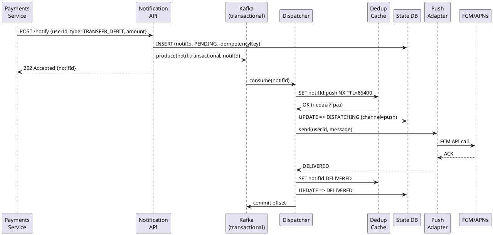
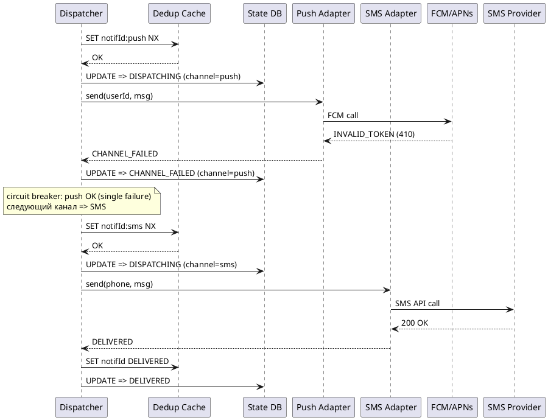
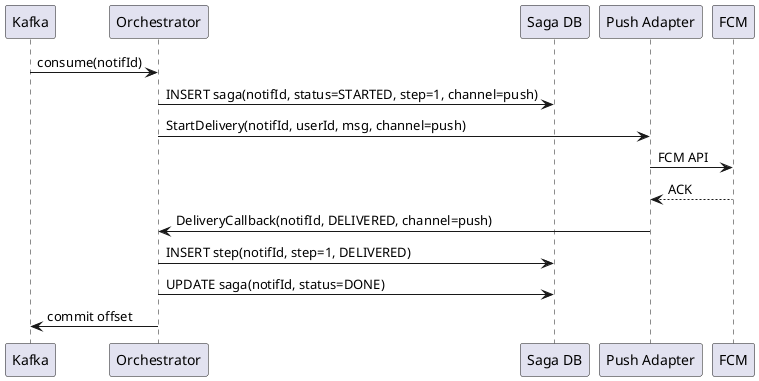
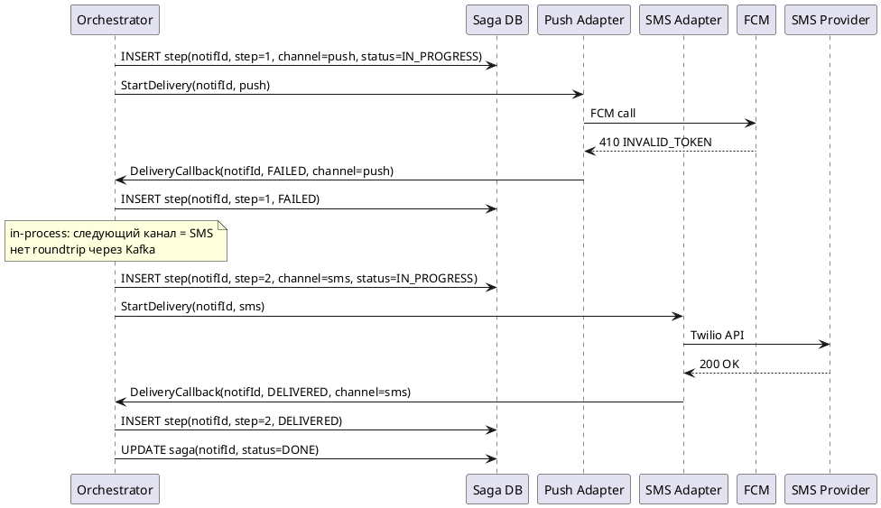

# ДЗ №4 - Требования и архитектурное мышление
## Централизованная платформа уведомлений - онлайн-банк


## Задание 1. Функциональные требования

Ниже - 8 требований к поведению системы, без привязки к конкретным технологиям. Приоритеты выставлены по модели MoSCoW.

| # | Приоритет | ID | Требование |
|---|-----------|-----|-----------|
| 1 | MUST | FR1 | Любой внутренний сервис банка (оплата, переводы, продукты, маркетинг) может отправить уведомление через единый API, не зная ничего о том, какой провайдер его доставит. |
| 2 | MUST | FR2 | Транзакционные уведомления (списание, зачисление, подтверждение перевода) доставляются пользователю не позднее заданного SLA с момента возникновения события. |
| 3 | MUST | FR3 | Если основной канал доставки недоступен или вернул ошибку, система самостоятельно переключается на резервный канал без участия отправителя. |
| 4 | MUST | FR4 | Одно уведомление не может быть доставлено пользователю более одного раза - ни при повторных попытках, ни при failover между каналами. |
| 5 | MUST | FR5 | Пользователь может выбрать предпочтительный канал доставки и отказаться от сервисных и маркетинговых уведомлений. Транзакционные уведомления нельзя отключить полностью. |
| 6 | MUST | FR6 | По каждому уведомлению система хранит историю попыток доставки (статус, канал, время, код ответа провайдера) и предоставляет к ней доступ через внутреннее API. |
| 7 | SHOULD | FR7 | Маркетинговые кампании адресуются до 1 млн пользователей за один запуск, с возможностью расписания и ограничения скорости отправки. |
| 8 | COULD | FR8 | Операционная команда видит в реальном времени: количество уведомлений в очереди, процент успешной доставки и состояние каналов - без необходимости лезть в логи. |

**Связь с бизнес-целями:**
- FR2, FR3, FR4 => гарантированная доставка критичных уведомлений
- FR5 => снижение жалоб (-30%), рост retention
- FR7, FR8 => централизованный контроль и возможность маркетинговых кампаний


## Задание 2. Нефункциональные требования

| # | Приоритет | ID | Требование |
|---|-----------|-----|-----------|
| 1 | MUST | NFR1 | **Latency.** Транзакционные уведомления: конец-в-конец ≤ 3 секунд (P95), ≤ 5 секунд (P99). |
| 2 | MUST | NFR2 | **Throughput.** Пиковая нагрузка - 60 000 уведомлений в минуту во время маркетинговых кампаний, при этом SLA транзакционных уведомлений не нарушается. |
| 3 | MUST | NFR3 | **Availability.** Сервис приёма и диспетчеризации уведомлений - 99.9% uptime (не более 8.7 ч простоя в год). |
| 4 | MUST | NFR4 | **Reliability.** Для транзакционных уведомлений - гарантия at-least-once: минимум 3 попытки с экспоненциальной задержкой, прежде чем уведомление считается недоставленным. |
| 5 | MUST | NFR5 | **Scalability.** Горизонтальное масштабирование без участия оператора: потребители очередей масштабируются автоматически в зависимости от глубины очереди. |
| 6 | MUST | NFR6 | **Observability.** Каждое уведомление прослеживается end-to-end через trace ID. Метрики (success rate, p99 latency, circuit breaker state) доступны в реальном времени. |
| 7 | SHOULD | NFR7 | **Cost.** Система выбирает наименее дорогой доступный канал. Push - приоритет, SMS - последний резерв. Целевой показатель: не более 10% транзакционных уведомлений уходит через SMS. |

### Оценка нагрузки

```
DAU: 3 000 000 пользователей

Транзакционные:  2/день * 3M = 6 000 000/день ≈ 70/сек (avg)
Сервисные:       3/день * 3M = 9 000 000/день ≈ 104/сек
Маркетинговые:   5/день * 3M = 15 000 000/день ≈ 174/сек

Итого avg: ≈ 350 уведомлений/сек
Пик (утренний трафик): ≈ 700–900/сек (*2–2.5 к среднему)

Кампания на 1M пользователей за 20 мин: 1 000 000 / 1 200 сек ≈ 833/сек
=> NFR2 (60 000/мин ≈ 1 000/сек) покрывает этот сценарий
```


## Задание 3. Архитектурно значимые требования (ASR)

### ASR-1. Изоляция throughput по приоритету

**Связанные требования:** FR7 (кампании на 1M), NFR1 (SLA транзакционных), NFR2 (60K/мин)

**Почему влияет на архитектуру:**
Это самое неочевидное требование. На первый взгляд, "просто сделайте очередь" - кажется достаточным. На деле: кампания на 1 миллион сообщений, опубликованная в одну общую FIFO-очередь, ставит транзакционное уведомление в хвост за 999 999 маркетинговыми. При пропускной способности 833 сообщения/сек - ожидание около 20 минут. Это несовместимо с 5-секундным SLA. Архитектура должна физически разделить потоки: отдельные топики/очереди с изолированными потребителями.


### ASR-2. Надёжная доставка без дублей

**Связанные требования:** FR3 (failover), FR4 (без дублей), FR6 (история), NFR4 (at-least-once)

**Почему влияет на архитектуру:**
Два требования противоречат друг другу: "доставь хотя бы раз" и "не доставь дважды". Решить это без персистентного состояния невозможно. Система должна знать для каждого уведомления: какой канал уже попробовали, с каким результатом. Это означает конечный автомат (state machine), хранящийся в надёжном хранилище, а не в памяти процесса. Выбор хранилища (реляционная БД, event log, Redis) - ключевое архитектурное решение с прямым влиянием на consistency guarantees при отказах.


### ASR-3. Независимость от конкретных провайдеров

**Связанные требования:** FR3 (failover), NFR3 (99.9%), NFR4 (reliability)

**Почему влияет на архитектуру:**
Внешние провайдеры SMS и email - чёрные ящики с собственными SLA, rate-limit'ами и паттернами отказов. Жёсткая зависимость от одного провайдера означает, что его недоступность - это недоступность всей платформы. Архитектурный ответ: абстракция провайдеров за интерфейсом, circuit breaker на каждый провайдер, fallback-цепочка каналов (push => email => SMS), приоритизированная по стоимости.


## Задание 4. Ключевые архитектурные вопросы

### АВ-1. Как разделить потоки уведомлений, чтобы не смешивать приоритеты?

**Порождают:** ASR-1, NFR2

**Почему важно:** Возможные ответы принципиально разные по сложности: (а) несколько отдельных топиков в одном брокере, (б) priority-queue в рамках одного топика, (в) полностью раздельные pipeline'ы для каждого типа. Каждый вариант имеет разные гарантии изоляции, операционную сложность и стоимость. Ошибка здесь влечёт нарушение SLA в момент первой крупной маркетинговой кампании.


### АВ-2. Где хранится состояние доставки, и как оно восстанавливается при падении сервиса?

**Порождают:** ASR-2, NFR4

**Почему важно:** Если сервис упал после того, как он отправил уведомление провайдеру, но до того, как записал результат - что произойдёт при рестарте? Ответ определяет: нужен ли transactional outbox, как именно коммитятся офсеты в брокере, нужна ли двухфазная запись. Разные ответы - принципиально разная надёжность и разные условия для дублей.


### АВ-3. Как система ведёт себя при частичном отказе провайдера (не полном, а с таймаутами)?

**Порождают:** ASR-3, NFR4, NFR7

**Почему важно:** Провайдеры редко падают полностью. Чаще - медленно отвечают или возвращают ошибки на 5–20% запросов. Без адаптивной логики (circuit breaker с настраиваемыми порогами) система либо будет ждать таймаутов вместо быстрого переключения (нарушение SLA), либо будет слишком быстро переключаться на SMS (рост затрат). Нужно решить: какие метрики определяют "отказ", при каких порогах открывается breaker.


## Задание 5. Архитектурные последствия ASR

### ASR-1 => последствия

- **Три отдельных топика** в брокере: `notif.transactional`, `notif.service`, `notif.marketing` - с изолированными группами потребителей
- **Независимое автомасштабирование** per-tier: transactional (min 2, max 8 инстансов), marketing (min 1, max 40)
- **Rate limiter per провайдер** (token bucket): при исчерпании квоты SMS у marketing-потребителей - shed load, а не блокировка transactional
- **Пакетная отправка** для email/push при кампаниях (batch API, до 1000 получателей за вызов)

### ASR-2 => последствия

- **Persistent state machine** в PostgreSQL: `PENDING => DISPATCHING => DELIVERED | CHANNEL_FAILED => FAILOVER | EXHAUSTED`
- **Idempotency key** = `hash(source_id + event_id + user_id)`, хранится вместе со статусом
- **Dedup-проверка** до каждой попытки отправки: если ключ уже есть со статусом DELIVERED - пропустить
- **Transactional outbox** в источниках: событие записывается в outbox-таблицу атомарно с основной транзакцией, CDC-коннектор публикует в брокер => нет потерь при crash источника

### ASR-3 => последствия

- **Circuit breaker per провайдер**: CLOSED => OPEN после N последовательных ошибок (N определяется тестированием), HALF-OPEN после 30с
- **Priority chain**: push (дёшево, быстро) => email (дёшево, медленнее) => SMS (дорого, надёжно)
- **Dead Letter Queue**: уведомления, исчерпавшие все каналы, попадают в DLQ с немедленным алертом на дежурного
- **Provider health dashboard**: circuit state, success rate, p99 latency - в Grafana в реальном времени


## Задание 6. Решения, которые не подходят

### Анти-решение 1: Синхронный REST-вызов к провайдеру из исходного сервиса

**Суть:** Сервис платежей вызывает Notification API синхронно, тот - SMS-провайдера, и ждёт ответа перед тем, как завершить транзакцию.

**Нарушает:** ASR-3 (зависимость от провайдера), ASR-1 (latency)

**Почему не подходит:** SMS-провайдер может отвечать 2–30 секунд, иногда - вовсе не отвечать. Это напрямую добавляется к времени выполнения банковской транзакции. При деградации провайдера - таймаут у пользователя на переводе. Retry-логика переносится в сервис-источник, возвращая нас к исходной проблеме децентрализации.


### Анти-решение 2: Единая FIFO-очередь для всех типов

**Суть:** Все уведомления - транзакционные, сервисные и маркетинговые - публикуются в одну очередь и обрабатываются одним пулом воркеров.

**Нарушает:** ASR-1 (throughput isolation)

**Почему не подходит:** Кампания на 1M пользователей заполняет очередь. Транзакционное уведомление встаёт в хвост. При 833 сообщениях/сек - ожидание ~20 минут. SLA в 5 секунд нарушается в 240 раз. FIFO-очередь не имеет механизма приоритетности по своей природе, и никакие настройки воркеров это не исправят без физической изоляции.


### Анти-решение 3: Хранение состояния доставки только в памяти процесса

**Суть:** Диспетчер ведёт map[notifId => status] в памяти, без записи в персистентное хранилище.

**Нарушает:** ASR-2 (at-least-once + dedup)

**Почему не подходит:** При рестарте процесса (деплой, OOM-kill, падение) всё состояние теряется. Уведомления, которые были в состоянии IN_FLIGHT, будут заново попытаны брокером - с риском дублирования. Уведомления, для которых нет записи о попытке push, могут никогда не получить SMS-fallback. Без персистентного конечного автомата невозможно выполнить ни гарантию доставки, ни гарантию отсутствия дублей.


## Задание 7. Неопределённости и архитектурные риски

### Неопределённость 1: Реальная надёжность push-уведомлений

**Что неизвестно:** FCM и APNs не гарантируют доставку - они возвращают ACK, что уведомление принято платформой, но не факт что оно появилось на экране. Тихий drop возможен при отсутствии WiFi, ограничении батареи, или политиках производителя (особенно Android). Неизвестно, какой реальный процент push "доходит" до восприятия пользователя, и при каком значении нужно автоматически escalate на SMS.

**Как проверить:**
- Добавить в мобильное приложение подтверждение получения (delivery receipt): при открытии уведомления - запрос к платформе
- Сравнить: FCM ACK vs. реальное подтверждение из приложения - дельта = "тихий drop rate"
- Запустить A/B: часть пользователей получает и push, и SMS с задержкой 10 сек, измерить % случаев, когда SMS было первым прочитанным


### Неопределённость 2: Требования к настройкам уведомлений с юридической точки зрения

**Что неизвестно:** Пользователь хочет отключить все каналы. Может ли он это сделать для транзакционных уведомлений о списании средств? В ряде юрисдикций банк обязан уведомить клиента о движении средств. Если пользователь "отключил всё" - несёт ли банк риск? Где граница между правом на молчание и регуляторным требованием?

**Как проверить:**
- Юридическая экспертиза: применимость PSD2, национального законодательства о платёжных сервисах
- Продуктовое решение: ввести "mandatory channel" - хотя бы один канал всегда активен (push по умолчанию), с явным согласием пользователя
- Пользовательское исследование: какой % пользователей действительно хочет отключить транзакционные уведомления (гипотеза: <1%)


# RFC: Гарантированная доставка критичных уведомлений с кросс-канальным failover

| Атрибут | Значение |
|---------|---------|
| **Статус** | ЧЕРНОВИК |
| **Автор** | [Имя] |
| **Дата создания** | 2026-04-07 |
| **Последнее обновление** | 2026-04-07 |
| **Ревьюеры** | [Команды: платформа, безопасность, продукт] |


## Содержание

1. [Контекст](#контекст)
2. [Пользовательские сценарии](#пользовательские-сценарии)
3. [Требования подсистемы](#требования-подсистемы)
4. [Варианты решения](#варианты-решения)
5. [Сравнительный анализ](#сравнительный-анализ)
6. [Вывод](#вывод)
7. [Приложение](#приложение)


## Контекст

### Постановка проблемы

Транзакционные уведомления - уведомления о списании, зачислении, подтверждении перевода - это единственный тип сообщений, где недоставка имеет прямые последствия для пользователя: он не знает, прошёл ли платёж, не видит подтверждения дебета. Это влияет на доверие и, потенциально, на правовую защиту банка.

При этом каналы доставки фундаментально различаются:

| Канал | Надёжность | Стоимость | Задержка | Ограничение |
|-------|-----------|-----------|----------|-------------|
| Push (FCM/APNs) | Средняя | ~0 | <1 с | Нужен установленный app, активное устройство |
| Email | Высокая | Низкая | 2–60 с | Неприемлема для sub-5s SLA |
| SMS | Высокая | Высокая (~50–100* push) | 1–10 с | Rate limits провайдеров |

Внешние провайдеры SMS и email работают нестабильно - полные отказы редки, но частичная деградация (5–20% ошибок, медленные ответы) - норма.

Задача подсистемы: гарантировать, что транзакционное уведомление придёт хотя бы через один канал, без дублей, с минимизацией стоимости.

### Контекст нагрузки

```
MAU: 10 000 000 | DAU: 3 000 000 | Peak concurrent: 300 000

Транзакционные: 2/день * 3M DAU = 6 000 000/день
  Средний поток: ≈ 70/сек
  Утренний пик (9:00–10:00): ≈ 180–200/сек
  Пиковый burst (зарплата, массовые операции): до 500/сек краткосрочно

SLA: P99 ≤ 5 сек end-to-end с момента публикации события
```


## Пользовательские сценарии

| # | Тип | Описание |
|---|-----|---------|
| 1 | Happy path | Пользователь делает перевод. Через 2 секунды - push с подтверждением дебета. |
| 2 | Failover по каналу | Push-токен устарел (смена телефона). Система получает INVALID_TOKEN, переключается на SMS. Итоговая доставка - в течение 5 сек. |
| 3 | Гонка подтверждений | Push отправлен, ACK задерживается. Система инициирует SMS-fallover. До отправки SMS приходит push ACK - SMS отменяется. Пользователь получает одно уведомление. |
| 4 | Предпочтения пользователя | Пользователь выбрал SMS как основной канал. Платформа отправляет транзакционные сразу через SMS, минуя push. |
| 5 | Полный отказ всех каналов | Push и SMS недоступны, email также не принимает запросы. Уведомление помещается в DLQ, дежурный получает PagerDuty-алерт в течение 1 минуты. |
| 6 | Наблюдаемость | On-call инженер видит алерт: success rate транзакционных push упал ниже 85%. Открывает Grafana - видит, что circuit breaker FCM-адаптера в состоянии OPEN. |


## Требования подсистемы

### Функциональные

| ID | Приоритет | Требование |
|----|-----------|-----------|
| FR-D-1 | MUST | Принять событие и гарантировать доставку хотя бы через один канал в пределах SLA. |
| FR-D-2 | MUST | При отказе канала автоматически перейти к следующему в цепочке (push => SMS => email для non-time-critical SMS => email для ultra-fast). |
| FR-D-3 | MUST | Не доставить одно уведомление дважды, в том числе при failover и retry. |
| FR-D-4 | MUST | Учитывать предпочтения пользователя по каналу; не разрешать полное отключение транзакционных уведомлений. |
| FR-D-5 | MUST | Хранить полную историю попыток (канал, время, код ответа) и предоставлять её через API. |
| FR-D-6 | MUST | Класть исчерпанные уведомления в DLQ с немедленным алертом для операционной команды. |

### Нефункциональные

| ID | Приоритет | Метрика |
|----|-----------|--------|
| NFR-D-1 | MUST | Latency P99 ≤ 5 сек end-to-end |
| NFR-D-2 | MUST | Success rate ≥ 99.5% за любые 24 часа |
| NFR-D-3 | MUST | Availability ≥ 99.9% |
| NFR-D-4 | MUST | 0 дублей при штатном failover |
| NFR-D-5 | MUST | Полная трассировка: от API входа до ACK или DLQ, через trace ID |
| NFR-D-6 | SHOULD | SMS-доля ≤ 10% транзакционных (остальные - push или email) |


## Варианты решения


### Вариант А: Реактивный пайплайн с изолированными очередями

#### Описание архитектуры

Уведомление принимается через API, публикуется в изолированный высокоприоритетный топик Kafka. Диспетчер (stateless) читает топик, проверяет dedup-кэш, обновляет статус в State DB, вызывает адаптер канала. Каждый адаптер обёрнут circuit breaker'ом. При ошибке - диспетчер публикует событие в тот же топик с пометкой "следующий канал". Failover - через повторную публикацию.

#### C4 Container Diagram (PlantUML)

```plantuml
@startuml C4_Variant_A
!include https://raw.githubusercontent.com/plantuml-stdlib/C4-PlantUML/master/C4_Container.puml

title Вариант А: Реактивный пайплайн

Person(usr, "Пользователь банка", "Получает уведомления")
System_Ext(srcsvcs, "Сервисы-источники", "Payments, Transfers, Products")
System_Ext(fcm, "FCM / APNs", "Push-провайдеры")
System_Ext(sms, "SMS-провайдер", "Twilio / SMSC")
System_Ext(email, "Email-провайдер", "AWS SES")

System_Boundary(np, "Notification Platform") {
    Container(api, "Notification API", "gRPC", "Принимает события, присваивает idempotency key, публикует в брокер")
    ContainerDb(statedb, "State DB", "PostgreSQL", "Конечный автомат: PENDING => DISPATCHING => DELIVERED | CHANNEL_FAILED => FAILOVER | EXHAUSTED")
    ContainerDb(dedup, "Dedup Cache", "Redis", "Idempotency keys, TTL 24ч")
    ContainerDb(prefcache, "Preference Cache", "Redis", "Настройки каналов пользователя, TTL 5 мин")
    Container(broker, "Message Broker", "Kafka", "Топики: notif.transactional, notif.service, notif.marketing, notif.dlq")
    Container(dispatcher, "Dispatcher", "Go", "Stateless. Читает notif.transactional, проверяет dedup, управляет failover, вызывает адаптеры")
    Container(pushadp, "Push Adapter", "Go", "FCM/APNs + circuit breaker")
    Container(smsadp, "SMS Adapter", "Go", "Twilio/SMSC + circuit breaker")
    Container(emailadp, "Email Adapter", "Go", "SES/SMTP + circuit breaker")
    Container(dlqsvc, "DLQ Service", "Go", "Алертинг, ручная доставка")
    Container(obs, "Observability", "Prometheus + Grafana + OTel", "Метрики, трейсы, дашборды")
}

Rel(srcsvcs, api, "POST notification", "gRPC")
Rel(api, statedb, "INSERT PENDING")
Rel(api, broker, "Publish => notif.transactional")
Rel(dispatcher, broker, "Consume notif.transactional")
Rel(dispatcher, dedup, "GET/SET idempotency key")
Rel(dispatcher, prefcache, "GET channel priority")
Rel(dispatcher, statedb, "UPDATE state")
Rel(dispatcher, pushadp, "Send push")
Rel(dispatcher, smsadp, "Send SMS")
Rel(dispatcher, emailadp, "Send email")
Rel(pushadp, fcm, "FCM API")
Rel(smsadp, sms, "SMS API")
Rel(emailadp, email, "SES API")
Rel(dispatcher, broker, "Publish => notif.dlq (если исчерпаны каналы)")
Rel(dlqsvc, broker, "Consume notif.dlq")
Rel(usr, fcm, "Получает push")
Rel(usr, sms, "Получает SMS")

@enduml
```

#### Sequence Diagram - основной сценарий (PlantUML)



#### Sequence Diagram - failover (PlantUML)



#### Соответствие ASR

| ASR | Как реализуется |
|-----|----------------|
| ASR-1 (SLA транзакционных) | Изолированный топик `notif.transactional` с dedicated consumer group. Диспетчер работает с polling interval ≤100ms. |
| ASR-2 (at-least-once без дублей) | Dedup Cache (Redis) + State DB (PostgreSQL). Перед каждой попыткой - атомарная проверка `SET NX`. |
| ASR-3 (независимость от провайдеров) | Circuit breaker на каждый адаптер, failover chain: push => SMS => email. DLQ при исчерпании всех вариантов. |

#### Технологии

- **Брокер:** Apache Kafka
- **State DB:** PostgreSQL 15 (партиционирование по notification_type)
- **Dedup:** Redis (SET NX + TTL)
- **Диспетчер:** Go, stateless, горизонтальное масштабирование
- **Push:** FCM + APNs через Firebase Admin SDK
- **SMS:** Twilio REST API / SMPP
- **Email:** AWS SES
- **Circuit breaker:** go-resilience / sony/gobreaker
- **Observability:** OpenTelemetry, Prometheus, Grafana, Alertmanager

#### Плюсы
- Простой и понятный пайплайн: всё через Kafka, можно независимо масштабировать адаптеры
- Диспетчер stateless => легко горизонтально масштабировать
- Адаптеры слабо связаны с оркестратором => можно передать разным командам

#### Минусы
- Dedup живёт в Redis, статус - в PostgreSQL. При частичном отказе (Redis жив, PG недоступен или наоборот) возможна рассинхронизация
- Failover через повторную публикацию в Kafka добавляет ~100–300 мс к каждому переключению канала
- Ошибка между commit Kafka offset и записью в State DB создаёт окно, где при рестарте уведомление может быть обработано дважды


### Вариант Б: Оркестратор с Saga-автоматом

#### Описание архитектуры

Вместо реактивной публикации-повторения failover управляется центральным Orchestrator-сервисом. Каждое уведомление - отдельная Saga со своим жизненным циклом. Оркестратор запускает шаги Saga (попытки каналов) последовательно, записывает каждый шаг в Saga DB атомарно, и при отказе шага синхронно инициирует следующий - без roundtrip через Kafka. Kafka используется только для приёма событий на входе.

#### C4 Container Diagram (PlantUML)

```plantuml
@startuml C4_Variant_B
!include https://raw.githubusercontent.com/plantuml-stdlib/C4-PlantUML/master/C4_Container.puml

title Вариант Б: Оркестратор с Saga-автоматом

Person(usr, "Пользователь банка", "Получает уведомления")
System_Ext(srcsvcs, "Сервисы-источники", "Payments, Transfers")
System_Ext(fcm, "FCM / APNs")
System_Ext(sms, "SMS-провайдер")
System_Ext(email, "Email-провайдер")

System_Boundary(np, "Notification Platform") {
    Container(api, "Notification API", "gRPC", "Приём событий, базовая валидация")
    Container(broker, "Message Broker", "Kafka", "Входной топик: notif.transactional. Нет retry-топиков.")
    ContainerDb(sagadb, "Saga DB", "PostgreSQL", "Append-only event log: каждое действие Orchestrator - новая строка. Source of truth.")
    Container(orch, "Delivery Orchestrator", "Java / Spring Boot", "Управляет Saga: инициирует шаги, обрабатывает callbacks, принимает решение о failover. Stateless - состояние в Saga DB.")
    Container(pushadp, "Push Adapter", "Go / gRPC", "FCM/APNs + circuit breaker. Callback в Orchestrator при завершении.")
    Container(smsadp, "SMS Adapter", "Go / gRPC", "Twilio + circuit breaker. Callback.")
    Container(emailadp, "Email Adapter", "Go / gRPC", "SES + circuit breaker. Callback.")
    Container(dlqsvc, "DLQ Service", "Go", "Обрабатывает EXHAUSTED саги, алертинг")
    Container(obs, "Observability", "OTel + Prometheus + Grafana")
}

Rel(srcsvcs, api, "POST /notify")
Rel(api, broker, "produce(notif.transactional)")
Rel(orch, broker, "consume")
Rel(orch, sagadb, "INSERT saga_step / UPDATE saga_state")
Rel(orch, pushadp, "StartDelivery()")
Rel(orch, smsadp, "StartDelivery() [failover]")
Rel(orch, emailadp, "StartDelivery() [failover]")
Rel(pushadp, orch, "DeliveryCallback(status)")
Rel(smsadp, orch, "DeliveryCallback(status)")
Rel(emailadp, orch, "DeliveryCallback(status)")
Rel(pushadp, fcm, "FCM API")
Rel(smsadp, sms, "SMS API")
Rel(emailadp, email, "SES API")
Rel(orch, dlqsvc, "Notify(EXHAUSTED)")
Rel(usr, fcm, "Получает push")
Rel(usr, sms, "Получает SMS")

@enduml
```

#### Sequence Diagram - основной сценарий



#### Sequence Diagram - failover



#### Соответствие ASR

| ASR | Как реализуется |
|-----|----------------|
| ASR-1 (SLA) | Failover в процессе Orchestrator - без Kafka roundtrip. Переключение канала занимает ~50 мс vs ~200 мс в Варианте А. |
| ASR-2 (at-least-once + dedup) | Idempotency key хранится в той же Saga DB, что и статус - атомарная проверка в одной транзакции. Нет разрыва между двумя хранилищами. |
| ASR-3 (provider resilience) | Circuit breaker внутри каждого адаптера + callback-модель: при FAILED - Orchestrator сразу инициирует следующий шаг. Полная история в Saga DB. |

#### Технологии

- **Брокер:** Apache Kafka (только входная точка)
- **Saga DB:** PostgreSQL 16, append-only event log per notification
- **Оркестратор:** Java 21 + Spring Boot 3, stateless, горизонтальное масштабирование
- **Адаптеры:** Go-микросервисы, gRPC callback-интерфейс
- **Push:** FCM + APNs
- **SMS:** Twilio
- **Email:** AWS SES
- **Circuit breaker:** Resilience4j
- **Observability:** OpenTelemetry (один trace per saga, span per step), Prometheus, Grafana

#### Плюсы
- Единый источник правды: Saga DB - полный аудит-лог каждого шага
- Failover в процессе оркестратора быстрее (нет Kafka roundtrip)
- Dedup атомарен с состоянием - нет рассинхронизации двух хранилищ
- Вся логика failover в одном месте: легко тестировать, менять правила

#### Минусы
- Orchestrator - более сложный сервис (concurrent sagas, timeout handling)
- Адаптеры связаны callback-интерфейсом с Orchestrator - менее decoupled
- Saga DB под нагрузкой 70+ sag/сек транзакционных: нужна партиционирование и тщательный индекс


## Сравнительный анализ

| Критерий | Вариант А (Реактивный) | Вариант Б (Оркестратор) |
|----------|----------------------|------------------------|
| Latency failover | +100–300 мс (Kafka roundtrip) | +~50 мс (in-process) |
| Consistency dedup | Eventual (два хранилища) | Strong (одна транзакция) |
| Сложность реализации | Ниже | Выше (~+2 нед.) |
| Операционная прозрачность | Нужно объединять 3 источника | Saga DB - единый аудит |
| Масштабируемость адаптеров | Независимая | Зависит от Orchestrator |
| Риск дублей при crash | Есть (окно между Redis и PG) | Минимален (атомарная запись) |

### Соответствие требованиям

| Требование | Вариант А              | Вариант Б              |
|-----------|------------------------|------------------------|
| FR-D-1 (SLA delivery) | +                      | +                      |
| FR-D-2 (failover) | +                      | +                      |
| FR-D-3 (dedup) | + (Redis + PG)         | + (атомарно, сильнее)  |
| NFR-D-1 (P99 ≤ 5с) | +                      | + (лучше при failover) |
| NFR-D-4 (0 дублей) | + (с риском при crash) | + (stronger guarantee) |
| ASR-1, 2, 3 | +                      | + (ASR-2 сильнее)      |


## Вывод

**Рекомендация: Вариант Б - Оркестратор с Saga.**

Ключевое обоснование - **корректность при отказах**. Для транзакционных уведомлений банка дублирование или потеря события - это не просто UX-проблема, это финансовые и юридические риски. Вариант Б обеспечивает более сильные гарантии:

1. **Атомарность dedup**: idempotency key и Saga state записываются в одной транзакции PostgreSQL. В Варианте А - два независимых хранилища, окно рассинхронизации при crash.

2. **Latency failover**: при отказе push Оркестратор переключается на SMS внутри процесса (~50 мс). В Варианте А - roundtrip через Kafka (~100–300 мс дополнительно), что сжирает бюджет 5-секундного SLA при цепочке отказов.

3. **Аудит и наблюдаемость**: Saga DB - append-only лог каждого шага доставки, готовый для Support и SLA-отчётности без корреляции трёх систем.

**Компромисс**: Orchestrator - более сложный в реализации (~+2 нед.). Это оправданно для транзакционных уведомлений. Для маркетинговых и сервисных - где дублирование менее критично - применим Вариант А как более простой.

**Предложение по фазированию:**
- Фаза 1: Вариант Б для транзакционных уведомлений (высокая критичность, <5% от объёма)
- Фаза 2: Вариант А для сервисных и маркетинговых (90%+ объёма, меньше требований к consistency)


## Приложение

### Глоссарий

| Термин | Определение |
|--------|-----------|
| ASR | Architecturally Significant Requirement - требование, напрямую влияющее на архитектурные решения |
| Circuit Breaker | Паттерн: прекращает вызовы к сервису после N ошибок на период cooldown |
| DLQ | Dead Letter Queue - очередь уведомлений, исчерпавших все попытки доставки |
| Failover | Автоматическое переключение на резервный канал при отказе основного |
| Idempotency Key | Ключ, позволяющий безопасно повторять операцию без побочных эффектов |
| Saga | Паттерн управления распределёнными транзакциями как последовательностью шагов |
| SLA | Service Level Agreement - зафиксированный порог производительности |
| Transactional Outbox | Паттерн: событие записывается в outbox-таблицу атомарно с основной транзакцией |
| P99 | 99-й перцентиль: 99% запросов укладываются в это время |
